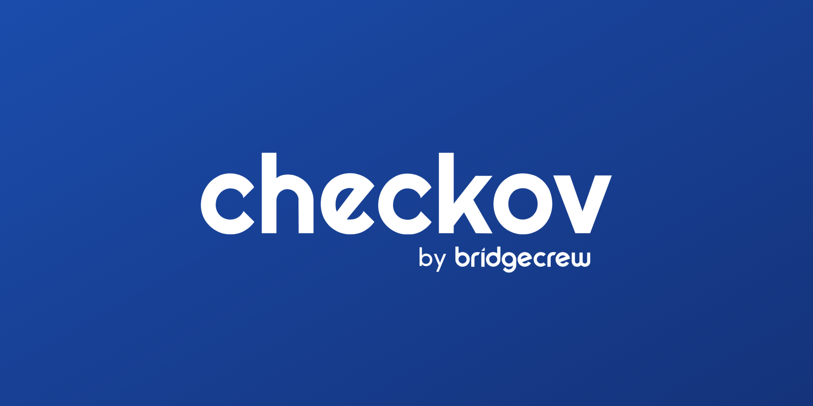

# Description

- This is a Checkov custom policy Repo to store all the custom policies needed for akumoproject4.
- Please make sure to create a feature branch to add any custom policy to the main branch.
- Please make sure to edit and add the custom policy Id in the README file.
- if you wanted to edit a policy please make sure to create a new one with a new Id and add it below to the guide section.

## Guide to use this policies

### in order to use these custom policy you will need the Id of the policy. below you can find the id and their descriptions.
- CKV_AWS_CUSTOM_TAGS => This policy will check all the resources to have both "env" & "team" tags. If not specified the resources will fail the check.

- CKV_AWS_CUSTOM_TYPES => This policy will check if the instances are either t2.micro or t2.medium.If something else the resource will fail the check.

## Contributors:
- @mheyderi